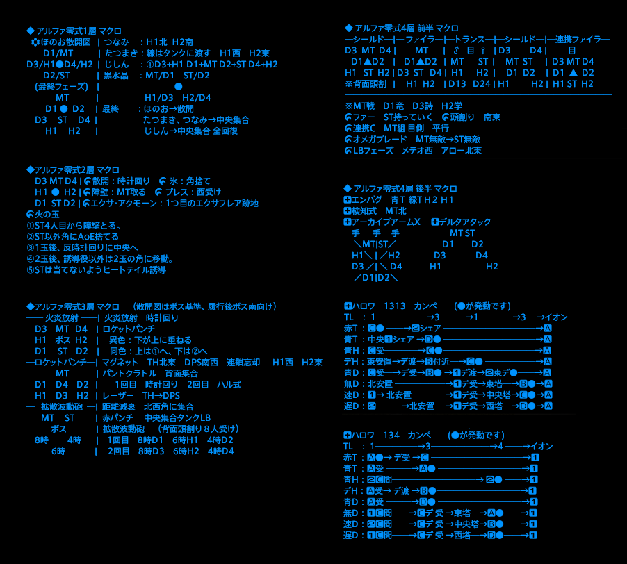

# alphascape
Final Fantasy XIVの次元の狭間オメガ零式：アルファ編のマクロです

見やすくかつ15行以内収まっています。  
そのままFF14のマクロ編集欄張り付けると整います。先頭行の/mlockはなくても構いません。  
あるとマクロ実行中に他のマクロが実行されても割り込みが禁止され、途中で途切れません。

[こちら](https://github.com/htppp/alphascape/releases/download/v1.0/alpha_macro.txt)
よりダウンロードできます。

4層後半のハローワールドのみ1313と134のマクロを分けています。  
募集に応じて出すといいと思います。  
まあ初週ではないので処理方法を書くのは違うと思いますから、  
1313です！134です！って言えばそれで充分で、マクロとして出す必要はないと思いますけどね。  

実際のSSは以下のようになります。  

